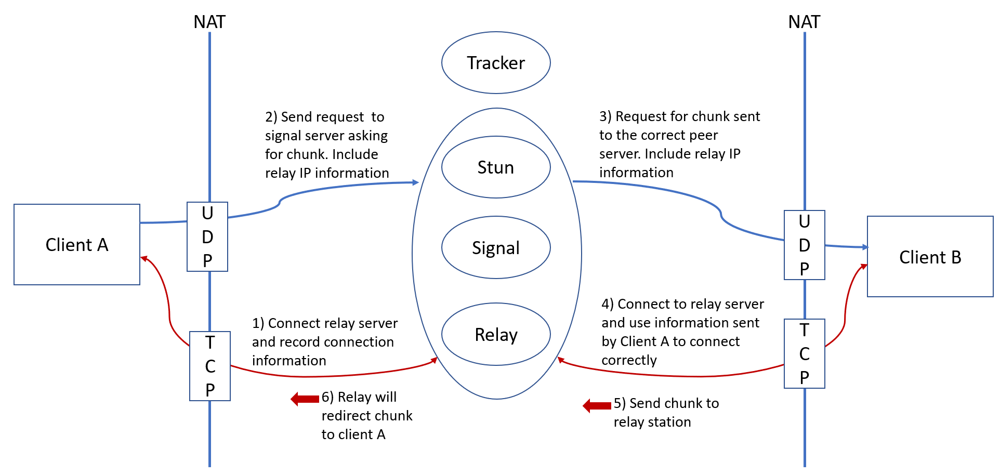

= CS3103_p2p

== Instructions to run code

The project's source code is written using in a Windows environment, specifically Windows 10. The
compiler used for our project is the Microsoft Visual C++ compiler.

Recommended way to compile the code is to first install CLion https://www.jetbrains.com/clion/download/#section=windows[here]. Alternatively, you can use Microsoft Visual Studio to build the solution using the files provided. However, the solution is not provided in this project.

Next, install Visual Studio Community https://visualstudio.microsoft.com/downloads/[here] for the use of the compiler.

After which, you can then load the source code into CLion and build it. Then, run p2p_client.exe to start the client application.

Tracker's IP address is given as 18.136.125.209.

== Protocol Design (With NAT, with central tracker)

=== Communication between tracker and p2p client

The centralised server (tracker) will be running on UDP Port 80.

It will contain a list, where each entry will be in the form _(filename, chunk_num, public_IP, port_num)_.

Suppose Harry wants to download a file _test.txt_, he will send the tracker a request. The tracker will respond to Harry a list of entries,
where _filename_ is equal to _test.txt_.

For our P2P application, if one wants to download a file, he or she will have to participate in the swarm involuntarily.
Thus, for every chunk Harry has successfully downloaded, he will inform the tracker and the tracker will
update its list to include _(test.txt, chunk_no, Harry's Public_IP, port_num)_.

Suppose Harry wants to exit from the swarm, he will inform the tracker and the tracker will delete the entries corresponding
to Harry.

Suppose Harry wants to upload a *new* file, Harry will divide the file
into chunks of fixed size, say 60 kilobytes, send it to tracker and tracker will update its list.

Any peer can query the tracker a list of files available or to query for a specified file.

==== Tracker request format

----
Format: REQUEST <FLAG> [<FILENAME>] [<CHUNK NO>] [<IP ADDRESS>] [<PORT NO>]
----

FLAG VALUES (values from 1 to 7)

. Download a file from the swarm. FILENAME value must be filled. (eg. REQUEST 1 test.txt)
. Unused
. Inform the tracker that a chunk has been successfully downloaded. FILENAME, CHUNK NO, IP ADDRESS and PORT NO must be filled.
(eg. REQUEST 1 192.168.1.2: 5667 test.txt 1|)
. Upload a new file. FILENAME, CHUNK NO, IP ADDRESS and PORT NO must be filled. (eg. REQUEST 4 192.168.1.2 5667 test.txt 1|test.txt 2|test.txt 3|)
. Exit from swarm. IP ADDRESS and PORT NO must be filled. (eg. REQUEST 5 192.168.1.2 5667)
. Query the tracker for a list of files available. (eg. REQUEST 6)
. Query for a specified file. FILENAME must be filled. (eg. REQUEST 7)

==== Tracker response format

----
Format: RESPONSE <LIST OF ENTRIES>
----

eg. RESPONSE test.txt 1 192.168.1.5 6881|test.txt 2 192.168.1.6 6881|
Note that each entry is seperated with a '|'.

----
Format: RESPONSE <LIST OF FILES>
----

eg. RESPONSE test.txt, test2.txt

----
Format: RESPONSE <SPECIFIED FILE>
----

eg. RESPONSE test.txt

=== Communication between p2p client and tracker

Each P2P server will be running on TCP Port 6881.

When Harry wants to download a file, he will obtain a list from tracker.

At the start, he will simply choose a random chunk from a random peer to download by sending "DOWNLOAD test.txt 1" message, for example.

Next, he will choose which chunks he does not have yet and from these chunks, randomly download one from a random peer.

There is a possibility that the chunk download from a peer will fail (eg. when the other peer exits). In this case, Harry
will simply randomly choose **another** peer to download the same chunk.

=== Examples
image::image/current.png[width="450"]
image::image/diagram.png[width="800"]

== P2P TURN server implementation due to Symmetric NAT

For P2P connection behind a symmetric NAT to take place, the P2P client and server will require to communicate through a signalling server. Peers will be required to get their Public IP and port that is connected to the signalling server and update the tracker for the entries. All signal communications will be relayed through the signalling server.

For transferring of chunks from a P2P server to a P2P client, in addition to a signalling server, a TURN server is required to relay the chunk from the P2P server to P2P client.

==== Signaller request format

----
Format: getPublic
----

----
Format: <Signalling Public IP:PORT of destination> <Request message>
----

==== TURN request format

----
Format: getPublic
----

----
Format: <TURN Public IP:PORT of destination> <Chunk>
----

==== Periodically check Public IP and Port number
All P2P server will periodically send a request to the signaling server at a 5 second interval to get its Public IP and Port Number. This
technique is known as 'UDP hole punching' to maintain the port state of the P2P server at the NAT router. If the received Public IP and Port number is different from the previously
requested and saved Public IP and Port number, it will update the tracker by sending its new public IP and Port Number. This is to ensure that the P2P clients and servers are able to communicate to each other via the signalling server.

==== Downloading a file

When a P2P client wants to download a file, the P2P client will send a request, containing its public IP port address that
it is connected to the TURN server, to the signalling server which will relay the request to the intended P2P server.
Once the P2P server receives the request, it will send the chunk to the TURN server specifying the public IP port address
of the P2P client that the P2P server wants to send the chunk to. The chunk will then be relayed to the client via the TURN server.

===== Example
Suppose Alice wants to get ‘example.txt’ and Bob happens to have the file:

. Alice requests list of peers from tracker who has the file 'example.txt' (The list should contain Bob UDP public IP:port)
. Alice establish TCP connection with relay server with TURN server 18.136.118.72:6882 and receives her public TCP IP:port
. Alice sends <Bob’s p2p_server UDP public IP:port> <Alice’s TCP public IP:port> <P2P protocol details> to the signal server
. Signal server transmit the message to Bob's P2P server
. Bob's P2P server establishes connection with TURN server with Alice’s TCP public IP:port
. Bob transmit chunk over to Alice via the TURN server

== Storage Chunking

We will use a 10 byte header for each chunk to differentiate the chunks when reading and writing chunks into storage.

Bytes of header:

0-3 - Chunk Number

4-7 - Chunk Content Size

8 - Final Chunk Flag. True for final chunk

9 - Unassigned

The extensions of the file will differentiate a partially downloaded file from a fully downloaded file.

==== Example

image::https://i.imgur.com/vdLktHr.png[Storage implement]
