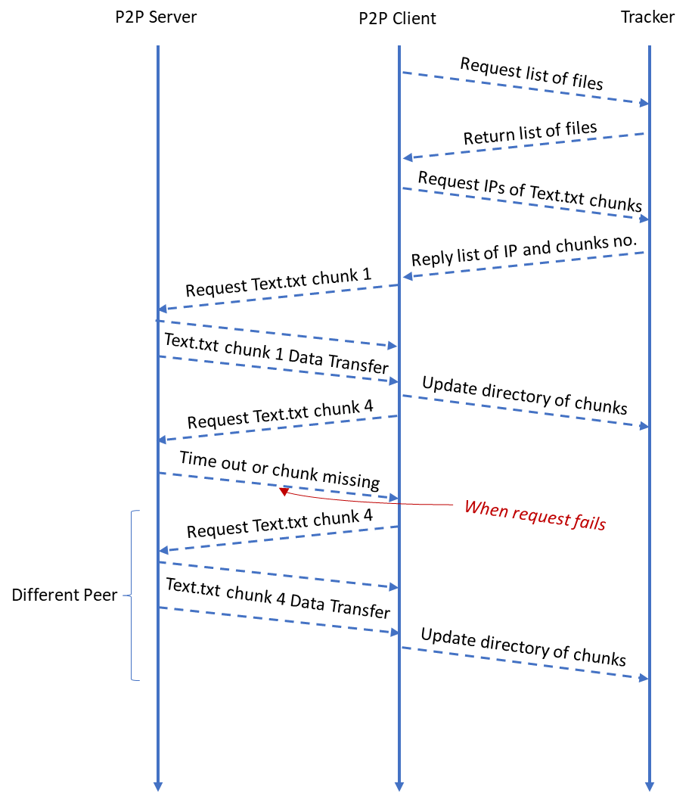
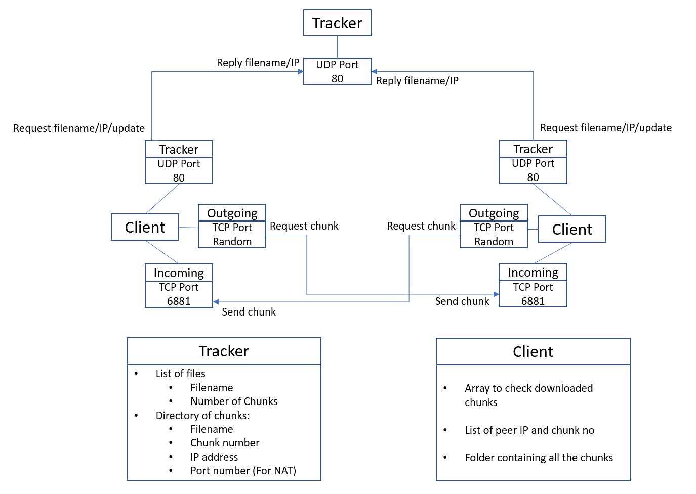

= CS3103_p2p

== Protocol Design (With NAT, with central tracker)

=== Communication between tracker and p2p client

The centralised server (tracker) will be running on UDP Port 80.

It will contain a list, where each entry will be in the form _(filename, chunk_num, public_IP, port_num)_.

Suppose Harry wants to download a file _test.txt_, he will send the tracker a request. The tracker will respond to Harry a list of entries, where _filename_ is equal
to _test.txt_.

For every chunk Harry has successfully downloaded, he will inform the tracker and the tracker will
update its list to include _(test.txt, chunk_no, Harry's Public_IP, port_num)_.

Suppose Harry wants to exit from the swarm, he will inform the tracker and the tracker will delete the entries corresponding
to Harry.

Suppose Harry wants to upload a *new* file, Harry will divide the file
into chunks of fixed size, say 2048 bytes, send it to tracker and tracker will update its list.

Any peer can query the tracker a list of files available or to query for a specified file.

==== Tracker request format

----
Format: REQUEST <FLAG> [<FILENAME>] [<CHUNK NO>] [<IP ADDRESS>] [<PORT NO>]
----

FLAG VALUES (values from 1 to 7)

. Download a file from the swarm. FILENAME value must be filled. (eg. REQUEST 1 test.txt)
. Ask the tracker for the updated list. FILENAME must be filled. (eg. REQUEST 2 test.txt)
. Inform the tracker that a chunk has been successfully downloaded. FILENAME, CHUNK NO, IP ADDRESS and PORT NO must be filled.
(eg. REQUEST 3 test.txt 1 192.168.1.2 5667)
. Upload a new file. FILENAME, CHUNK NO, IP ADDRESS and PORT NO must be filled. (eg. REQUEST 4 192.168.1.2 5667 test.txt 1 test.txt 2 test.txt 3)
. Exit from swarm. IP ADDRESS and PORT NO must be filled. (eg. REQUEST 5 192.168.1.2 5667)
. Query the tracker for a list of files available. (eg. REQUEST 6)
. Query for a specified file. FILENAME must be filled. (eg. REQUEST 7)

==== Tracker response format

----
Format: RESPONSE <LIST OF ENTRIES>
----

eg. RESPONSE test.txt 1 192.168.1.5 6881|test.txt 2 192.168.1.6 6881

----
Format: RESPONSE <LIST OF FILES>
----

eg. RESPONSE test.txt, test2.txt

----
Format: RESPONSE <SPECIFIED FILE>
----

eg. RESPONSE test.txt

=== Communication between p2p client and p2p server

Each P2P server will be running on TCP Port 6881.

When Harry wants to download a file, he will obtain a list from tracker.

At the start, he will simply choose a random chunk from a random peer to download by sending "DOWNLOAD test.txt 1" message, for example.

Next, he will choose which chunks he does not have yet and from these chunks, randomly download one from a random peer.

There is a possibility that the chunk download from a peer will fail (eg. when the other peer exits). In this case, Harry
will (a) ask the tracker for the new updated list and (b) randomly choose **another** peer to download the same chunk.

=== Examples

== P2P STUN server implementation due to Non-Symmetric NAT

For P2P connection behind a non-symmetric NAT to take place, the P2P client and server will require each others Public IP and Port assigned by the NAT. The peers will be required to get their Public IP and port via a STUN server.

The P2P peer will send a request from port 6881 to any Public STUN (RFC5389) server requesting for their public IP addresse and Port numbers.

=== Getting Public IP and Port number

The P2P will contact the STUN server in the following scenarios:

==== Download and Upload of file

When the P2P wants to download and upload a file, the P2P will send a request to the STUN server for its Public IP and Port number after that it will proceed to download and upload the file and update the tracker.

==== Periodically check Public IP and Port number
P2P server will periodically send a request to STUN server at a 10 second interval to get its Public IP and Port Number. If the recieved Public IP and Port number is different from the previously requested and saved Public IP and Port number, it will update the tracker by sending its new public IP and Port Number.

==== Example
image::https://i.imgur.com/xnZcM9e.png[STUN implement]

== Storage Chunking

We will use a 10 byte header for each chunk to differentiate the chunks when reading and writing chunks into storage.

Bytes of header:

0-3 - Chunk Number

4-7 - Chunk Content Size

8 - Final Chunk Flag. True for final chunk

9 - Unassigned

The extensions of the file will differentiate a partially downloaded file from a fully downloaded file.

==== Example

image::https://i.imgur.com/vdLktHr.png[Storage implement]
